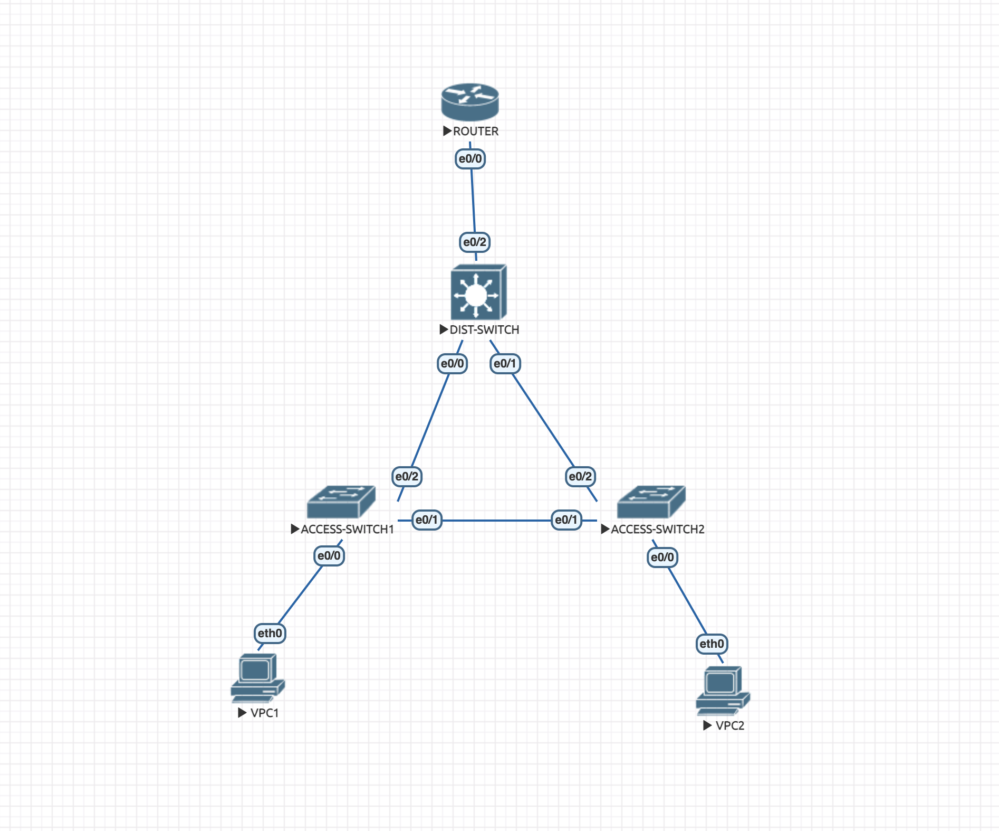
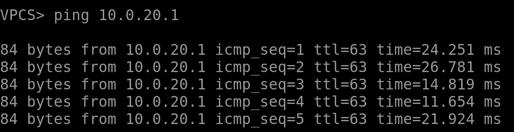
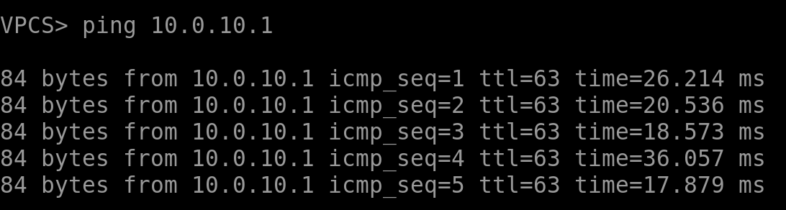
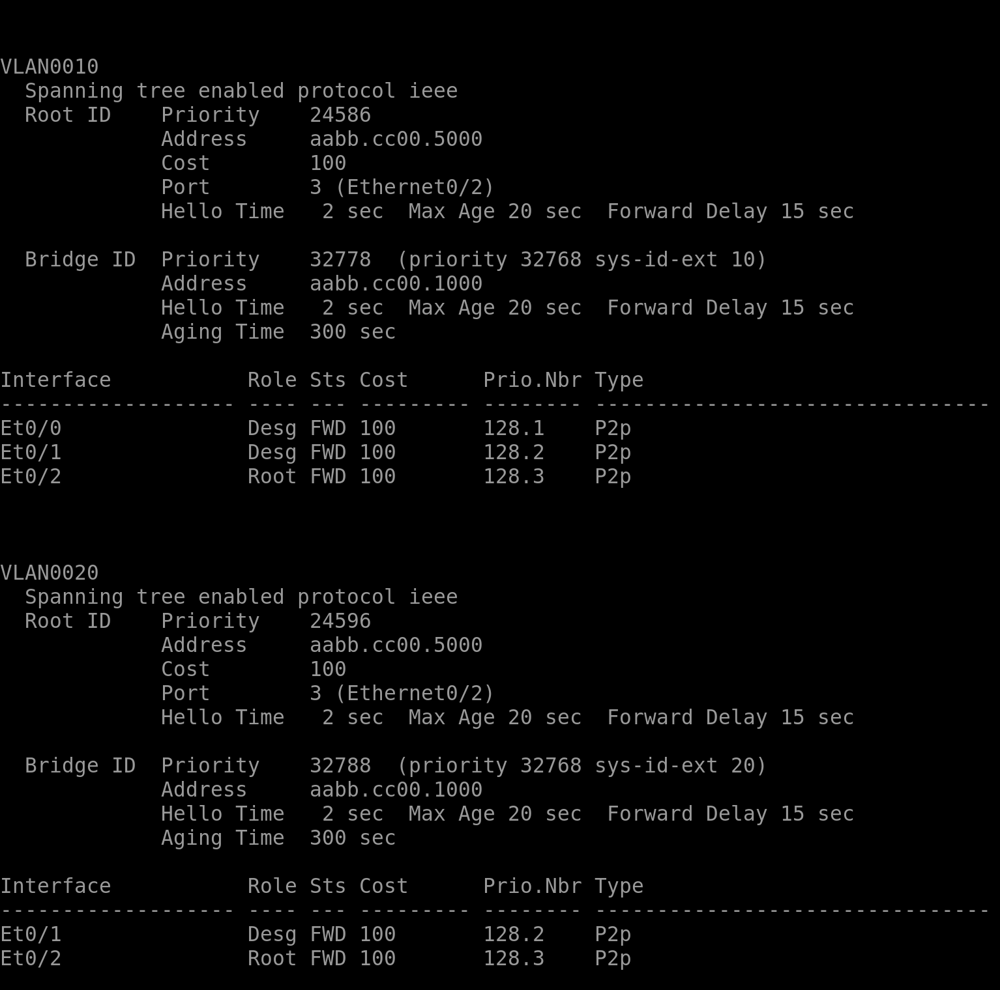
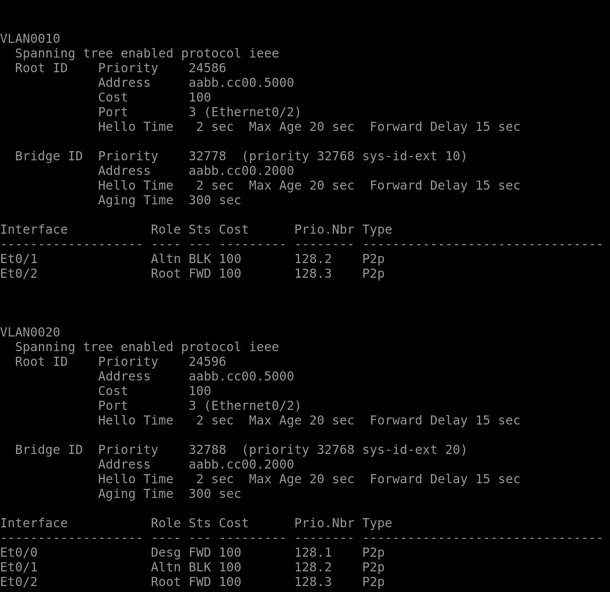
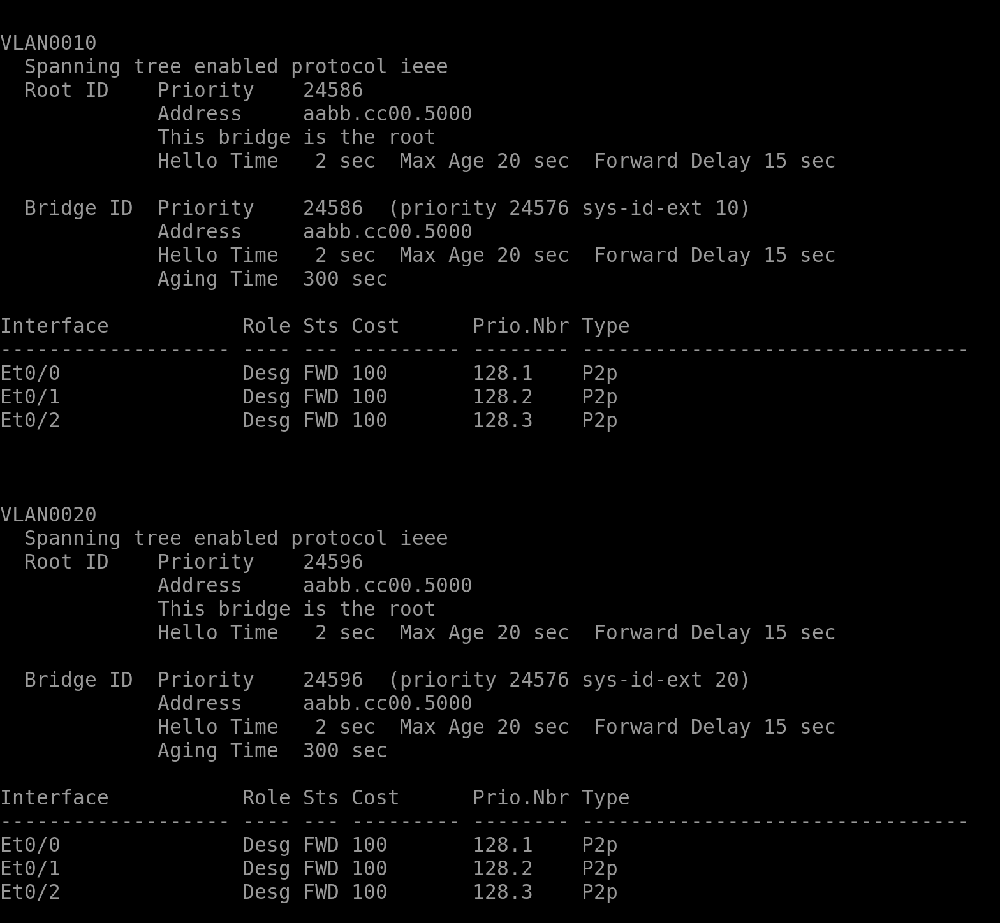
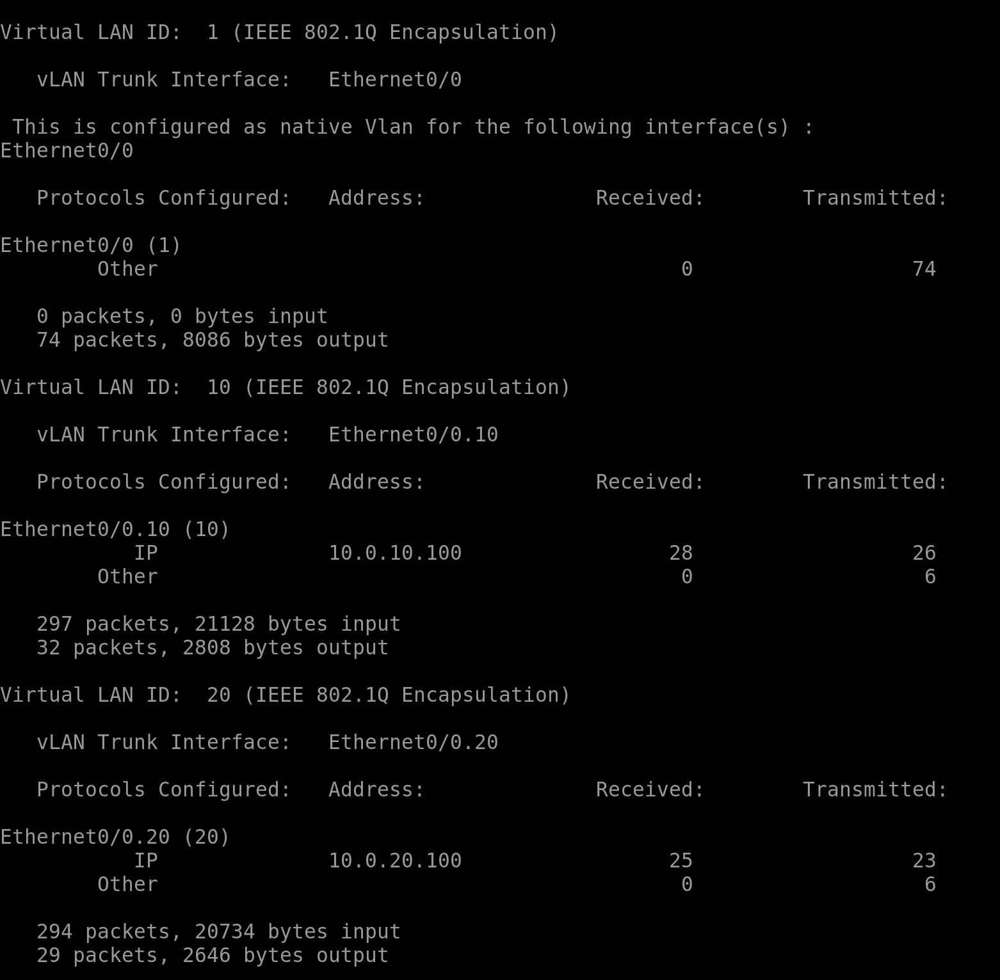

Экспортированная лабораторная находится в этой же папке. Далее будет отчет с выводами устройств и примеры команд, использованных для конфигурации. Работы выполнена в EVE-NG.

## Топология



## Выводы устройств

Пинг клиентом 1 клиента 2


Пинг клиентом 2 клиента 1


Результаты `show spanning-tree` для коммутатора уровня доступ 1


Результаты `show spanning-tree` для коммутатора уровня доступ 2


Результаты `show spanning-tree` для коммутатора уровня распределения


Вывод настроенных VLAN на маршрутизаторе


## Команды конфигурации

1. Для коммутаторов уровня доступ на портах e0/0 устаналиваем режим access для соответствующих VLAN и режим trunk для остальных портов, разрешаем через trunk-порты только настроенные VLAN. Пример для первого коммутатора:

```
enable
conf t
vlan 10
vlan 20
int e0/0
switch mode access
switch access vlan 10
exit
int e0/1
switchport trunk allowed vlan 10,20
switchport trunk encapsulation dot1Q
switchport mode trunk
exit
int e0/2
switchport trunk allowed vlan 10,20
switchport trunk encapsulation dot1Q
switchport mode trunk
exit
exit
copy run sta
```

2. Для коммутатора уровня распределения проделываем то же самое, но теперь все порты делаем транковыми.

3. Для коммутатора уровная распределения делаем его корнем STP обеих VLAN:

```
enable
spanning-tree vlan 10 root primary
spanning-tree vlan 20 root primary
copy run sta
```

4. Для маршрутизатора поднимаем интерфейс e0/0, создаем 2 подинтерфейса (для каджого из VLAN), устаналиваем на них соответствующие IP-адреса:

```
enable
conf t
int e0/0
no shutdown
exit
int e0/0.10
encapsulation dot1Q 10
ip address 10.0.10.100 255.255.255.0
exit
int e0/0.20
encapsulation dot1Q 20
ip address 10.0.20.100 255.255.255.0
exit
exit
copy run sta
```

5. Для клиентов задаем IP-адрес с соответствующих шлюзом. Пример для первого клиента (в VLAN 10):

```
ip 10.0.10.1 255.255.255.0 10.0.10.100
save
```