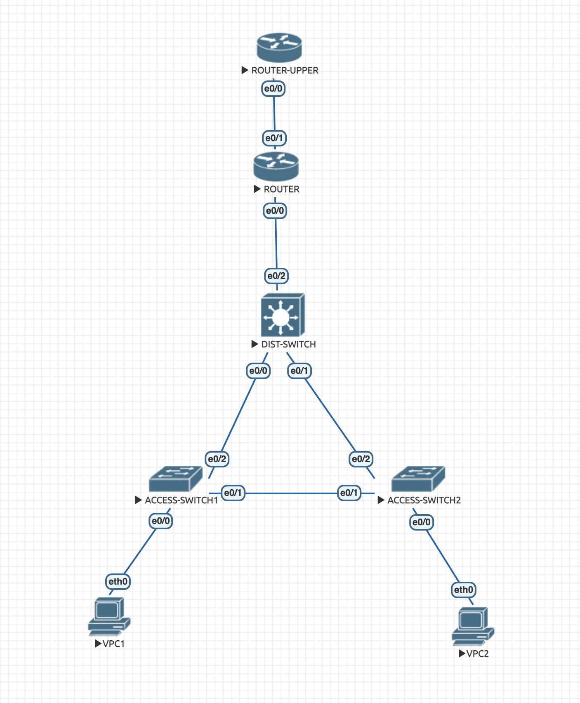
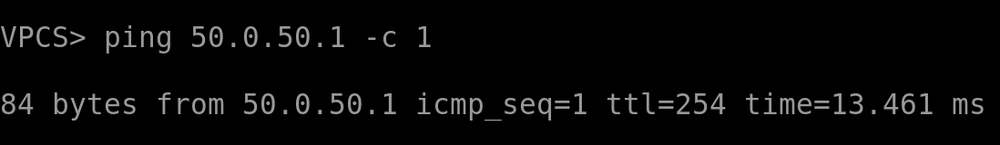
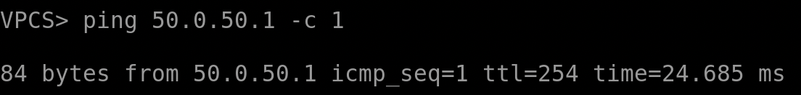
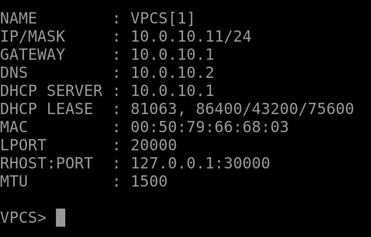
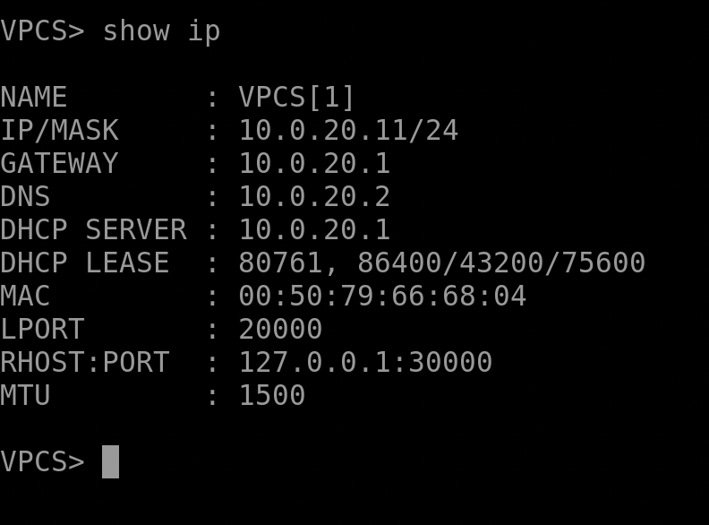
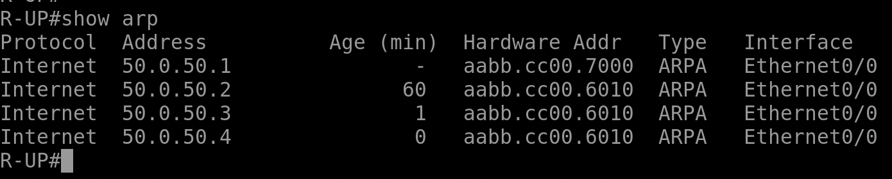

## Домашняя работа 3

Ниже приведен отчет с выводами устройств, а далее - примеры команд, выполненных для конфигурации

## Выводы устройств

Топология


Пинг верхнего роутера



Полученные по DHCP конфигурации:



Отсутствие приватных ip-адресов на верхнем роутере:


## Настройка

1. Настраиваем DHCP. На нижнем роутере:
```
enable
conf t
int e0/0.10
ip address 10.0.10.1 255.255.255.0
exit
int e0/0.20
ip address 10.0.20.1 255.255.255.0
exit
ip dhcp pool DHCP_10.0.10.0
network 10.0.10.0 255.255.255.0
default-router 10.0.10.1
dns-server 10.0.10.2
exit
ip dhcp pool DHCP_10.0.20.0
network 10.0.20.0 255.255.255.0
default-router 10.0.20.1
dns-server 10.0.20.2
exit
ip dhcp excluded-address 10.0.10.1 10.0.10.10
ip dhcp excluded-address 10.0.20.1 10.0.20.10
exit
copy run sta
```
2. Настраиваем получение IP-адресов по DHCP на клиентах:
```
ip dhcp
```
3. Настраиваем интерфейс на верхнем роутере:
```
enable
conf t
int e0/0
no shutdown
ip address 50.0.50.1 255.255.255.0
exit
copy run sta
```
4. Настраиваем NAT на нижнем роутере. Используем динамический NAT с пулом 50.0.50.3 - 50.0.50.100 (таким образом, спокойно будут работать до 100 устройств). Также настраиваем ACL
```
enable
conf t
ip nat pool main 50.0.50.3 50.0.50.100 netmask 255.255.255.0
access-list 100 permit ip 10.0.10.0 0.0.0.255 any
access-list 100 permit ip 10.0.20.0 0.0.0.255 any
ip nat inside source list 100 pool main overload
int e0/0.10
ip nat inside
exit
int e0/0.20
ip nat inside
exit
int e0/0
ip nat inside
exit
int e0/1
ip address 50.0.50.2 255.255.255.0
ip nat outside
no shutdown
exit
exit
copy run sta
```
