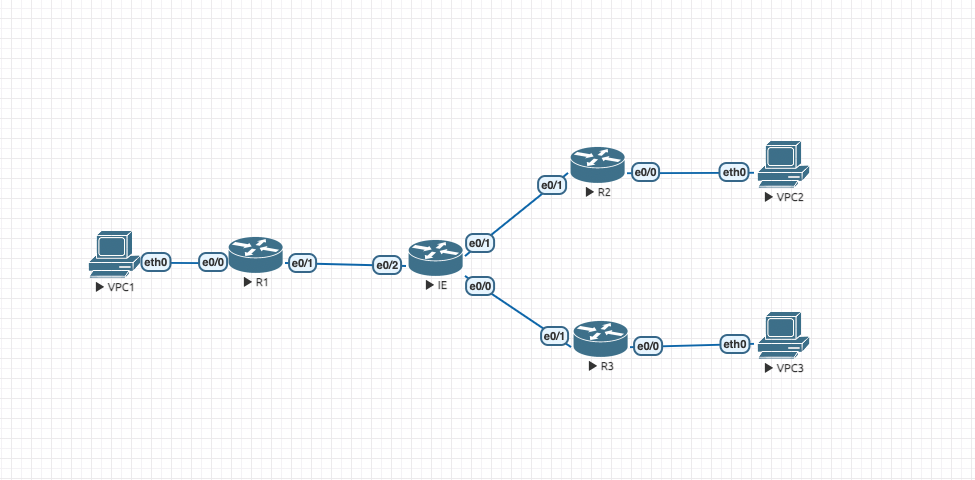
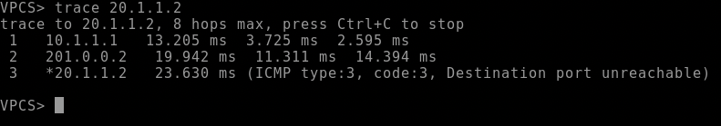
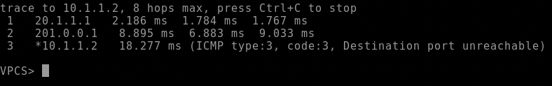
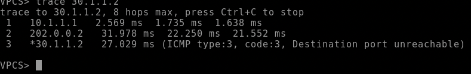
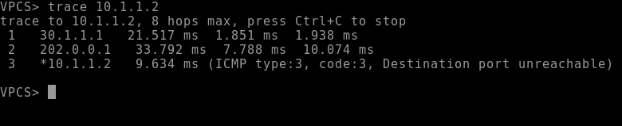
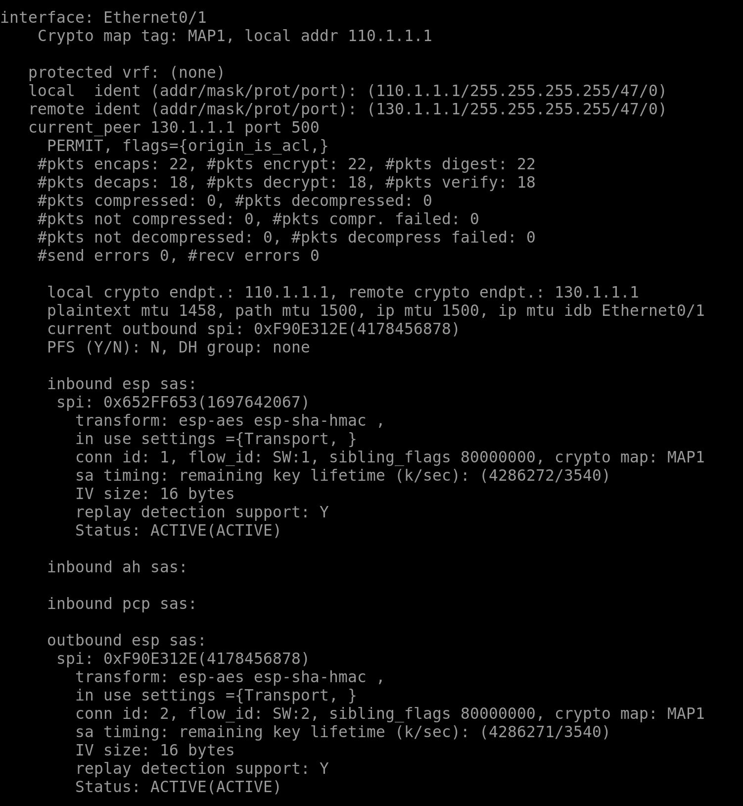
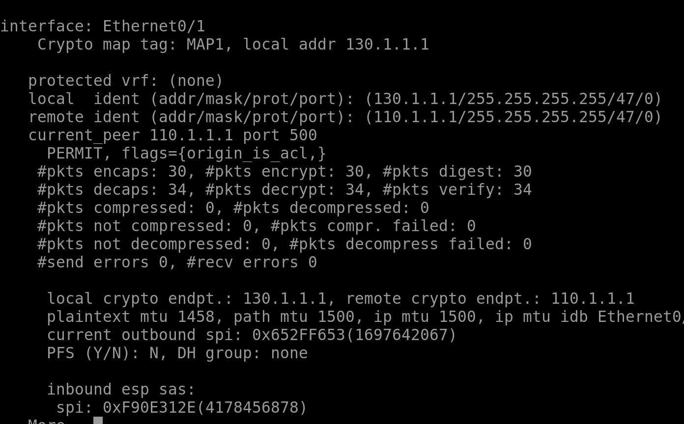

Домашняя работа 4 по курсу "Компьютерные сети"

## Отчеты

Топология


`trace route` для между клиентами 1 и 2



`trace route` для между клиентами 1 и 3



Счетчики шифрования



## Конфигурация

1. Поднимаем нужные порты на маршрутизаторах R1, R2, R3. Пример для R1:
```
enable
conf t
int e0/0
no shutdown
ip address 10.1.1.1 255.255.255.0
int e0/1
no shutdown
ip address 110.1.1.1 255.255.255.0
exit
exit
```
2. Присваиваем IP-адреса клиентам (10.1.1.2/24, 20.1.1.2/24, 30.1.1.2/24), пример для первого:
```
ip 10.1.1.2 255.255.255.0 10.1.1.1
```
3. Поднимаем порты маршрутизатора, эмулирующего интернет. Пример для порта к первому маршрутизатору:
```
enable
conf t
int e0/2
ip address 110.1.1.2 255.255.255.0
no shutdown
exit
exit
```
4. Поднимаем туннельный интерфейс от маршрутизатор 1 к маршрутизатору 2. Из 2 в 1 конфигурация симметричная, но адрес 
```
int tun0
ip address 201.0.0.1 255.255.255.252
tunnel source 110.1.1.1
tunnel destination 120.1.1.1
ip route 0.0.0.0 0.0.0.0 110.1.1.2
ip route 20.1.1.0 255.255.255.0 201.0.0.2
```
5. Поднимаем туннельный интерфейс между 1 и 3 точно так же (адреса концов будут 202.0.0.1/30 и 202.0.0.2/30)
6. Ставим IPSec с шифрованием AES. Пример для первого роутера, для третьего симметрично:
```
crypto isakmp policy 1
encr aes
authentication pre-share
crypto isakmp key CISCO address 130.1.1.1
crypto ipsec transform-set AES128-SHA esp-aes esp-sha-hmac
mode transport
crypto map MAP1 10 ipsec-isakmp
set peer 130.1.1.1
set transform-set AES128-SHA
match address 101
int e0/1
crypto map MAP1
access-list 101 permit gre host 110.1.1.1 host 130.1.1.1
exit
exit
```
7. Пускам трафик, проверяем с помощью `trace` и `show crypto ipsec sa` что шифрование работает